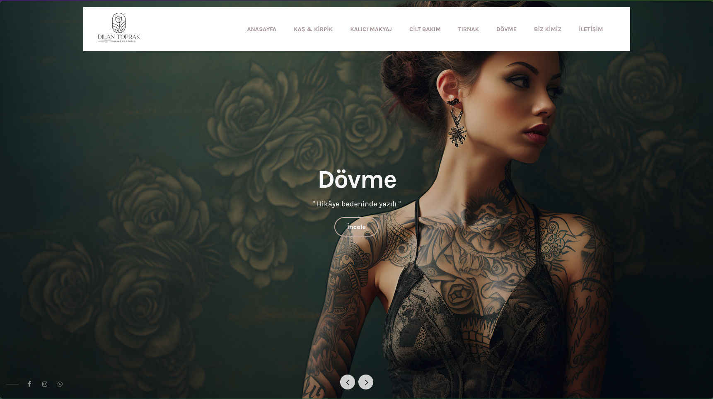
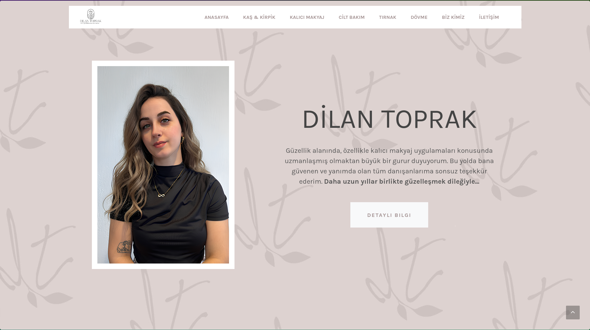
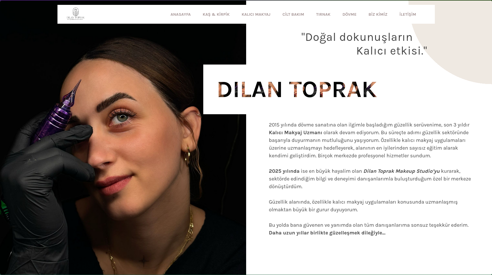

# Dilan Toprak Makeup Studio Website

This is a corporate website I designed and developed for **Dilan Toprak Makeup Studio**.  
After project completion, the website was handed over to the client.

🌐 **Live site:** [dilantoprakmakeupstudio.com](https://www.dilantoprakmakeupstudio.com/)

---

## 💡 About the Project

- **Purpose:** Showcase the studio’s makeup services and portfolio with an elegant design.
- **Technologies:**
  - HTML5, CSS3, JavaScript

---

## 🎨 Features

- Responsive, mobile-first design  
- SEO-optimized structure  
- Fast and lightweight  
- Elegant color palette and typography suited for beauty industry  

---

## 👤 Developer

This project was designed and developed by **[Talha](https://github.com/talha-uk)**  
All rights belong to the client.

---

📅 **Project period:** Apr 2025
🔄 **Status:** Completed — no longer actively maintained.

## 🖼️ Screenshots

  
  
  

